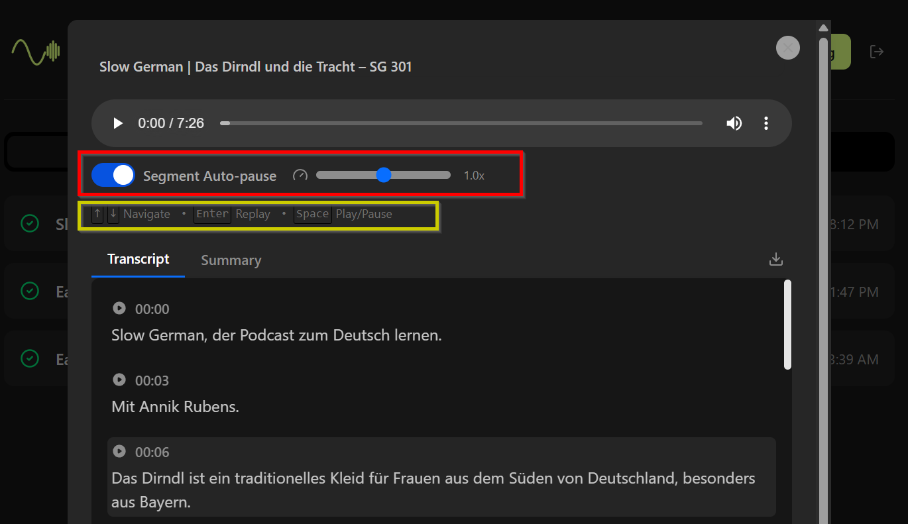
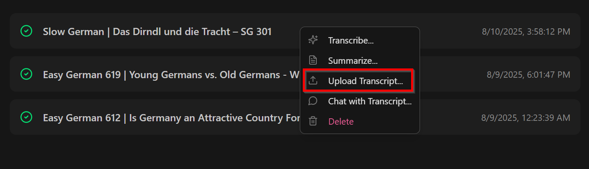
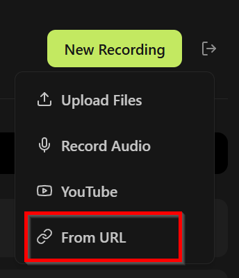

# Scriberr_LL: Customized Scriberr Specifically for Language Learning

## Introduction
The repo is based on the fantastic [Scriberr](https://github.com/rishikanthc/Scriberr) project and I'm adding more features to make it more convient for language learners who want to study the materials interest them most. Personally, I'm learning German and I prefer to learn from Podcasts. This tool makes repeating the podcast segments easy and effective.

## Features
### Major Differences
The base features can be found on the [Scriberr](https://github.com/rishikanthc/Scriberr) project. Here are the major differences between this fork and the original project:
- It has better keyboard ineractions on the audio detail page: 
  - `Space` key to play and pause the audio player when any audio segment is in focuse.
  - `↑` or `↓` key to navigate among segments.
  - A segment being played is automatically focused so users can interact with it more efficiently.
  - User can togle if the player should pause when a segment is finished.
- Clicks no more start playing the segment, but the default behaviors are reserved to select texts. It's more convinient for users to copy the transcripts and paste them to other places such as dictionaries. An additional play button is placed in every segment so users can use that to jump among segments.
### Planned Features
- [x] Add an entry to let users import transcripts for audios, so they can locally transcribe the audio and upload the transcript to a public site for sharing. 
- [x] Add an entry to let user download audios from URLs. 

- [ ] Add support for transcribing audios via external Whisper APIs, so it can be hosted on low end servers.
- [ ] Add support for using S3 as the storage backend.


## Quick Start

### Hardware Requirement

### Running with Docker Compose (CPU Only)
1. Download the [docker-compose.yml](./docker-compose.yml) file to your working directory.
2. Create a `.env` to include the essential environment variables
```
OPENAI_API_KEY=<your_openai_api_key>
OPENAI_BASE_URL=<your_openai_base_url>
SESSION_KEY=<your_session_key>
HF_TOKEN=<your_hf_token>
SCRIBERR_USERNAME=<your_scriberr_username>
SCRIBERR_PASSWORD=<your_scriberr_password>
# optional to constrain model options
SCRIBERR_OPENAI_MODELS="gpt-5-chat,gpt-5-mini"
```
3. Run `docker compose up -d` to start the container and you can access the application at port `8080`


## License

This project is licensed under the MIT License. See the [LICENSE](LICENSE) file for details.

## Acknowledgments

- [Scriberr](https://github.com/rishikanthc/Scriberr)
- [OpenAI Whisper](https://github.com/openai/whisper)
- [WhisperX](https://github.com/m-bain/whisperX)
- [HuggingFace](https://huggingface.co/)
- [PyAnnote Speaker Diarization](https://huggingface.co/pyannote/speaker-diarization)
- [Ollama](https://ollama.ai/)

